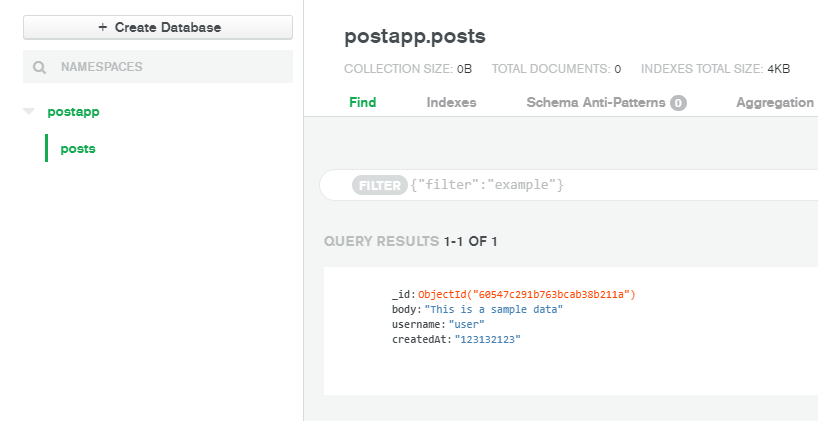
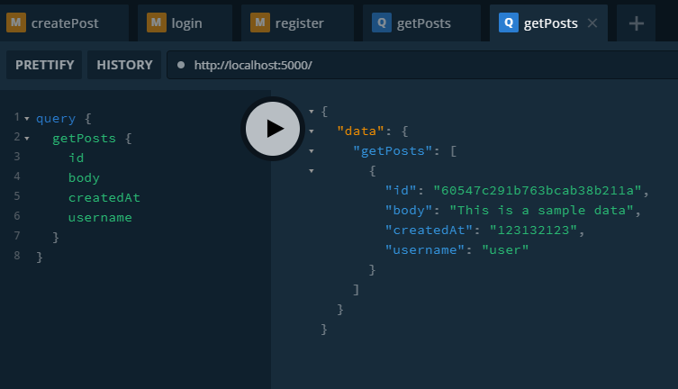

# merng-postapp-server-GraphQL API

## Reference

- [Classsed - GraphQL Server Series(MERNG)](https://www.youtube.com/watch?v=YBydg_Ui02Q&list=PLMhAeHCz8S3_CTiWMQhL6YxX7vZ7z84Zo)

## Stack && Dependencies

- [MongoDB](https://www.mongodb.com/cloud/atlas)
  - [mongoose](https://github.com/Automattic/mongoose)
- [Apollo-GraphQL](https://www.apollographql.com/docs/tutorial/introduction/)
  - [apollo-server](https://www.apollographql.com/docs/apollo-server/)
  - [graphql](https://graphql.org/)
- [node express jwt Authenticatoin](https://www.techiediaries.com/node-express-jwt-authentication/)
  - [bcryptjs](https://github.com/dcodeIO/bcrypt.js)
  - [jsonwebtoken](https://github.com/auth0/node-jsonwebtoken)

## Init

```sh
> yarn init

> type NUL > index.js
> type > .gitignore

// .gitignore
node_modules
```

## MongoDB Setup

- 1. New Project : create data storage
- 2. Security : create user / add network access ip

## [Apollo Server](https://www.apollographql.com/docs/apollo-server/getting-started/)

- 1. Install dependencies

```sh
> yarn add apollo-server graphql mongoose
```

- 2. Define your GraphQL schema

```js
// index.js
const { gql } = require('apollo-server');

const typeDefs = gql`
 type Query {
  sayHi: String!
 }
`;
```

- 3. Define your data set

```js
// index.js
const books = [
 {
  title: 'The Awakening',
  author: 'Kate Chopin',
 },
 {
  title: 'City of Glass',
  author: 'Paul Auster',
 },
];
```

- 4. Define a resolver

```js
// index.js
const resolvers = {
 Query: {
  sayHi: () => 'HelloWorld',
 },
};
```

- 5. Create an instance of ApolloServer

```js
// index.js
import { ApolloServer } == require('apollo-server');

const server = new ApolloServer({typeDefs,resolvers});

server.listen().then(({ url }) => {
 console.log(`🚀  Server ready at ${url}`);
});
```

- 6. Start the server

```
> node index.js

🚀 Server ready at http://localhost:4000/
```

- 7. Execute your first query

## mongoDB connect

- 1. master user id/password
- 2. connect > connect your application > connect code

```js
// config.js
module.exports = {
 MONGODB: 'mongodb connect code',
};
```

```js
// index.js
const mongoose = require('mongoose');
const { MONGODB } = require('./config');

mongoose
 .connect(MONGODB, { useNewUrlParser: true, useUnifiedTopology: true })
 .then(() => {
  console.log('MongoDB connected!');
  return server.listen({ port: 5000 });
 })
 .then((res) => {
  console.log(`🚀  Server ready at ${res.url}`);
 });
```

## Defined data schema

- user

```js
// models/User.js
const { model, Schema } = require('mongoose');

const userSchema = new Schema({
 username: String,
 password: String,
 email: String,
 createdAt: String,
});

module.exports = model('User', userSchema);
```

- post

```js
const { model, Schema } = require('mongoose');

const postSchema = new Schema({
 body: String,
 username: String,
 createdAt: String,
 comments: [
  {
   body: String,
   username: String,
   createdAt: String,
  },
 ],
 likes: [
  {
   username: String,
   createdAt: String,
  },
 ],
 user: {
  type: Schema.Types.ObjectId, // user data를 사용
  ref: 'users',
 },
});

module.exports = model('Post', postSchema);
```

## get data

```js
// index.js
const Post = require('./models/Post');

const typeDefs = gql`
 type Post {
  id: ID!
  body: String!
  createdAt: String!
  username: String!
 }
 type Query {
  getPosts: [Post]
 }
`;

const resolvers = {
 Query: {
  async getPosts() {
   try {
    const posts = await Post.find();
    return posts;
   } catch (err) {
    throw new Error(err);
   }
  },
 },
};
```

- dummy data

  </img>

- get data

  </img>

## token

- install

```
> yarn add bcryptjs jsonwebtoken
```

- create token

```js
// graphql/resolvers/users.js
const bcrypt = require('bcryptjs');
const jwt = require('jsonwebtoken');
const { SECRET_KEY } = require('../../config');

const generateToken = (user) => {
 return jwt.sign(
  {
   id: user.id,
   email: user.email,
   username: user.username,
  },
  SECRET_KEY,
  { expiresIn: '1h' } // 1시간 유지
 );
};

module.exports = {
 Mutation: {
  async register(
   _,
   { registerInput: { username, email, password, confirmPassword } }
  ) {
   //  TODO:  USER 비밀번호 hash화
   password = await bcrypt.hash(password, 12);

   const newUser = new User({
    email,
    username,
    password,
    createdAt: new Date().toISOString(),
   });

   // TODO: DB 저장후, TOKEN생성을 위한 USER정보
   const userInfo = await newUser.save();

   // TODO: JWT에 USER정보를 넣어 TOKEN 생성
   const token = generateToken(userInfo);

   return {
    userInfo,
    token,
   };
  },
 },
};
```

## validate

```js
// util/validators.js
module.exports.validateRegisterInput = (
 username,
 email,
 password,
 confirmPassword
) => {
 const errors = {};

 console.log('dd');

 // TODO : validate username
 if (username.trim() === '') {
  errors.username = 'Username must not be empty';
 }

 // TODO : validate email
 if (email.trim() === '') {
  errors.email = 'Email must not be empty';
 } else {
  const regEx = /^[0-9a-zA-Z]([-_.]?[0-9a-zA-Z])*@[0-9a-zA-Z]([-_.]?[0-9a-zA-Z])*.[a-zA-Z]{2,3}$/i;
  //? : / / 안에 있는 내용은 정규표현식 검증에 사용되는 패턴이 이 안에 위치함
  //? : / /i 정규표현식에 사용된 패턴이 대소문자를 구분하지 않도록 i를 사용함
  //? : ^ 표시는 처음시작하는 부분부터 일치한다는 표시임
  //? : [0-9a-zA-Z] 하나의 문자가 []안에 위치한 규칙을 따른다는 것으로 숫자와 알파벳 소문지 대문자인 경우를 뜻 함
  //? : * 이 기호는 0또는 그 이상의 문자가 연속될 수 있음을 말함

  if (!email.match(regEx)) {
   errors.email = 'Email must be a valid email address';
  }
 }

 // TODO : validate password
 if (password === '') {
  errors.password = 'Password must not be empty';
 } else if (password !== confirmPassword) {
  errors.confirmPassword = 'Password must match';
 }

 return {
  errors,
  valid: Object.keys(errors).length < 1,
 };
};
```

```js
// graphql/resolvers/users.js
const { validateRegisterInput } = require('../../util/validators');

const { valid, errors } = validateRegisterInput(
 username,
 email,
 password,
 confirmPassword
);

//* valid: Object.keys(errors).length < 1 ==> error 유무판단, 없으면 true
if (!valid) {
 throw new UserInputError('Errors', { errors });
}
```

## [Authentication(인증) / Authorization(인가)](https://www.apollographql.com/docs/apollo-server/security/authentication/)

- context 옵션에 할당된 함수는 모든 요청에 대해 호출이 되고 요청 정보를 인자로 받기떄문에 인증 토큰을 검증하는 장소로 적합하다.
- context 레벨에 담겨있는 허가내용과 user의 token을 비교하여 사용자 인증

```js
// index.js
const server = new ApolloServer({
 typeDefs,
 resolvers,
 context: ({ req }) => {
  // Note: This example uses the `req` argument to access headers,
  // but the arguments received by `context` vary by integration.
  // This means they vary for Express, Koa, Lambda, etc.
  //
  // To find out the correct arguments for a specific integration,
  // see https://www.apollographql.com/docs/apollo-server/api/apollo-server/#middleware-specific-context-fields

  // Get the user token from the headers.
  const token = req.headers.authorization || '';

  // Try to retrieve a user with the token
  const user = getUser(token);

  // Add the user to the context
  return { user };
 },
});
```

## keyword

- context.headers.authorization은 언제 생성되는가
- pubsub의 개념에 대해

## error
